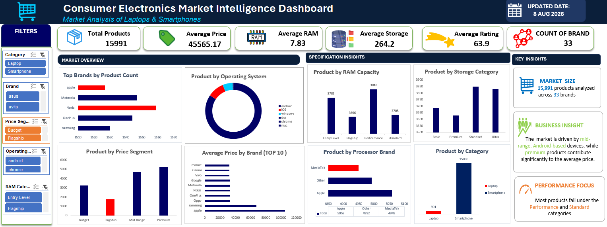
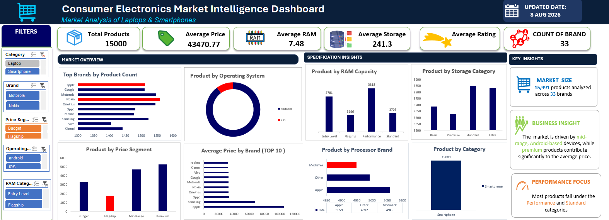

# Consumer Electronics Market Intelligence Dashboard

### Market Analysis of Laptops & Smartphones

> An interactive **Excel-based market intelligence case study** that transforms product-level consumer electronics data into actionable insights on **market structure, pricing, brands, and product specifications**.

---

## 📌 Project Overview

The **Consumer Electronics Market Intelligence Dashboard** analyzes laptops and smartphones across brands, pricing segments, operating systems, RAM, storage, processors, display size, and ratings.

The project combines:

- **Power Query** for data preparation and transformation
- **Pivot Tables** for analysis
- **Slicers** for interactive filtering
- **Dynamic KPIs** for market and segment-level analysis
- **Interactive dashboard visualizations**
- **Business insights and recommendations** based on the analysis

The objective is to move from **product-level data to business-oriented insights** that can support market assessment, competitive benchmarking, pricing analysis, and product positioning.

---

## 🎯 Business Objective

The analysis is structured around business questions covering **market distribution, pricing, brand competition, operating systems, RAM, storage, processors, display size, and price–specification relationships**.

The dashboard allows these questions to be explored across different categories, brands, price segments, operating systems, and RAM groups.

---

## 📊 Market Snapshot

| KPI | Overall Market Baseline |
|---|---:|
| **Total Products** | **15,991** |
| **Brands** | **33** |
| **Average Price** | **45,565.17** |
| **Average RAM** | **7.83** |
| **Average Storage** | **264.2** |
| **Average Rating** | **63.9** |

> **Note:** KPI values are dynamic and change when filters are applied. The values above represent the overall dashboard baseline.

---

## 🖥️ Dashboard

### Overall Market View

**What it is for:**  
Provides an overall view of the market through KPIs and visualizations covering product categories, brands, pricing segments, operating systems, RAM, storage, and processors.

---

### Filtered Market View

**What it is for:**  
Demonstrates how the dashboard can be used to investigate a specific market segment by applying filters such as category, brand, price segment, operating system, and RAM category.

---

## 🔎 Key Business Insights

### 1. Smartphones dominate the product portfolio

The category analysis shows a strong concentration of products in **smartphones**, while laptops represent a much smaller portion of the displayed portfolio.

**Business implication:**  
Combined-market averages should be interpreted carefully because the product mix is uneven. Category-level analysis provides a more meaningful comparison.

---

### 2. Android is the dominant operating-system group

The operating-system distribution is strongly concentrated around **Android**, while iOS and laptop-focused operating systems represent smaller portions of the displayed distribution.

**Business implication:**  
Android represents the largest operating-system group in the current dataset. OS analysis should still be separated by category because smartphone and laptop ecosystems differ.

---

### 3. Mid-Range and Premium segments have strong product volume

The price-segment analysis shows the highest displayed product volumes in **Premium and Mid-Range**, followed by Budget, while Flagship represents a smaller portion.

**Business implication:**  
The market is not dominated only by entry-level products. Pricing strategy should consider both **product volume and market positioning**.

---

### 4. Performance configurations represent a major RAM segment

The RAM analysis shows the highest displayed product volume in the **Performance** category, followed by Entry Level, Standard, and Flagship.

**Business implication:**  
Performance-oriented configurations represent an important part of the current assortment and can be useful for product benchmarking.

---

### 5. Standard and Ultra storage categories show strong volume

The storage analysis shows strong product volumes in **Standard and Ultra** storage categories.

**Business implication:**  
These configurations can be used as reference points when evaluating product assortment and specification positioning.

---

### 6. Brand volume and brand pricing tell different stories

The dashboard compares **product count by brand** with **average price by brand**.

A brand with a large product portfolio may focus on broad market coverage, while a brand with fewer products but higher average pricing may have stronger premium positioning.

**Business implication:**  
Competitive benchmarking should consider both **assortment breadth and pricing**, rather than product count alone.

---

### 7. Processor mix provides another competitive perspective

The processor analysis shows **Apple, Other, and MediaTek** as major groups in the displayed view.

Because processor ecosystems differ between smartphones and laptops, processor analysis becomes more meaningful when evaluated separately by category.

**Business implication:**  
Processor-level analysis can support product benchmarking and specification-based competitive analysis.

---

### 8. Interactive filtering is a key strength of the dashboard

The dashboard allows users to filter the analysis by:

- Category
- Brand
- Price Segment
- Operating System
- RAM Category

The KPI cards and charts respond to these selections.

**Analytical takeaway:**  
The dashboard works as an **exploration tool**, allowing users to move from the overall market view into specific segments and investigate follow-up questions quickly.

---

## 💡 Business Recommendations

### 01 — Use category-specific benchmarks

Since smartphones dominate the displayed portfolio, pricing and specification benchmarks should be evaluated separately for smartphones and laptops.

### 02 — Combine assortment and pricing metrics

Product count should be analyzed together with average price to distinguish broad-market brands from premium-positioned brands.

### 03 — Build specification benchmarks

RAM, storage, processor, rating, and price should be analyzed together to identify potential **price-performance opportunities**.

### 04 — Use slicers for segment analysis

Begin with the overall market and then drill into specific categories, brands, price segments, operating systems, or RAM groups.

### 05 — Connect analysis to business decisions

The dashboard should be used not only to report numbers but also to answer specific market questions and support decisions around **pricing, assortment, benchmarking, and positioning**.

---

## 📄 Project Documentation

The dashboard is supported by two documents that explain the analytical thinking behind the project.

### Business Questions

The document defines the **10 business questions** covered by the Excel analysis, including market distribution, pricing, brands, RAM, storage, operating systems, processors, display size, and price–specification relationships.

**[View Business Questions](docs/Consumer_Electronics_Business_Questions.docx)**

### Insight Report

The Insight Report converts the dashboard analysis into **business findings, implications, recommendations, and interpretation notes**.

**[View Consumer Electronics Market Intelligence Insight Report](docs/Consumer_Electronics_Market_Insight_Report_Final.pdf)**

---

## 🛠️ Tools & Skills

### Tools

- Microsoft Excel
- Power Query
- Pivot Tables
- Slicers
- Pivot Table Connections
- Excel Dashboard

### Skills Demonstrated

- Data Cleaning & Transformation
- Exploratory Data Analysis
- KPI Development
- Market Segmentation
- Brand Benchmarking
- Price Analysis
- Product Specification Analysis
- Interactive Dashboard Design
- Business Insight Generation
- Decision-Oriented Reporting

---

## 📌 Project Takeaway

This project demonstrates an end-to-end approach to **Excel-based business analytics**, transforming product-level consumer electronics data into an interactive market intelligence dashboard.

The analysis brings together **market structure, competitive presence, pricing, and product specifications** to create a practical framework for exploring the consumer electronics market.

---

### Project Details

**Scope:** Laptops & Smartphones  
**Primary Tool:** Microsoft Excel  
**Methods:** Power Query • Pivot Tables • Slicers • Interactive Dashboard  
**Dashboard Updated:** 8 August 2026
